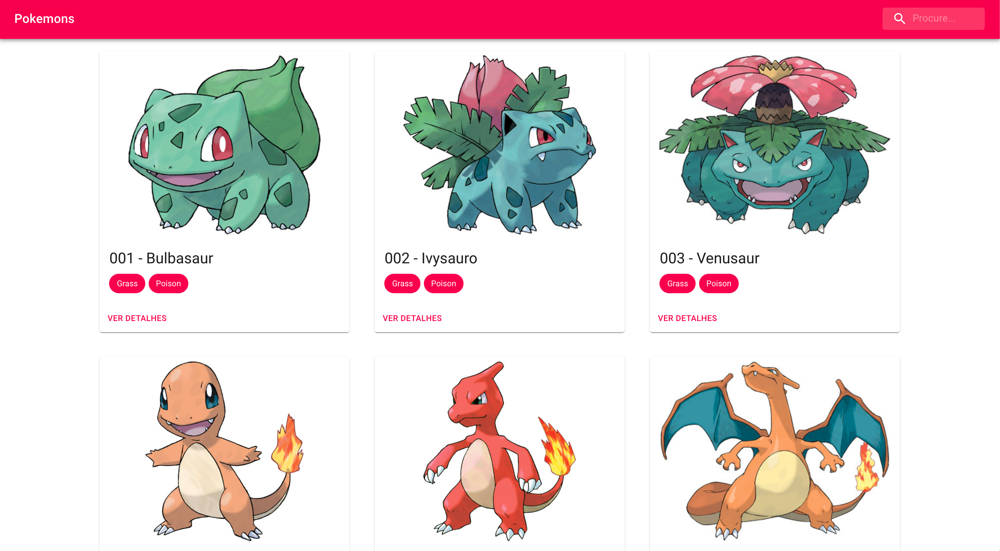
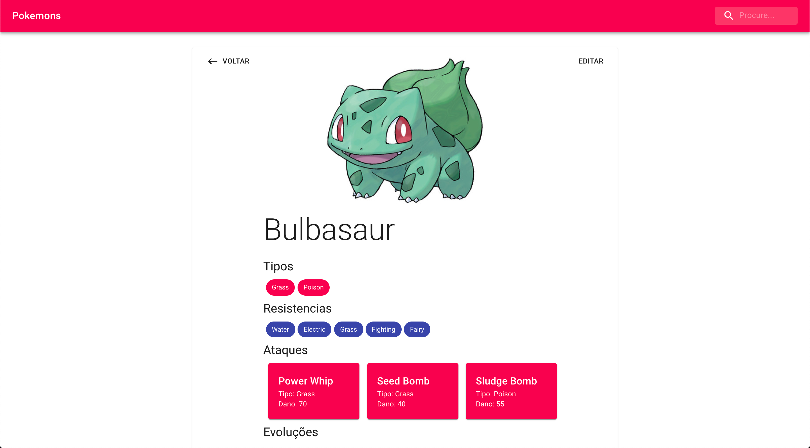
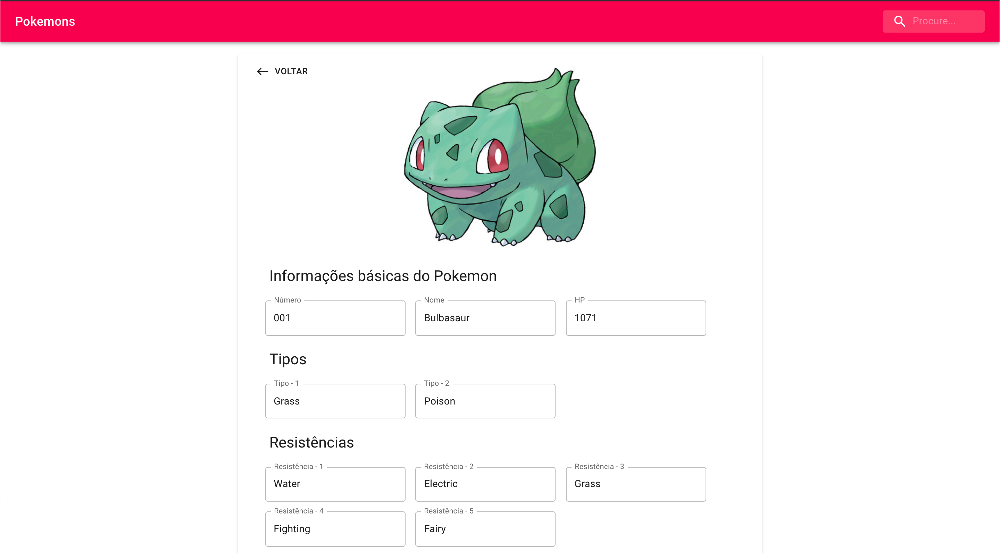

## Pokemon GraphQL

Site desenvolvido em ReactJs. Consumindo a seguinte API GraphQL: https://github.com/lucasbento/graphql-pokemon

-----

-----

##Tecnologias Utilizadas
* [React-router-dom](https://reactrouter.com/web/guides/quick-start)
* [Redux](https://redux.js.org/introduction/getting-started)
* [Apollo (Integração com React Hooks)](https://www.apollographql.com/docs/react/)
* [LibraryTesting/React](https://testing-library.com/docs/react-testing-library/intro)
* [Material UI](https://material-ui.com/)

##Informações para rodar o projeto
####Instalar dependências e executar
``yarn ou npm install``
``yarn start ou npm run start``
####Testes
``yarn test ou npm run test``
